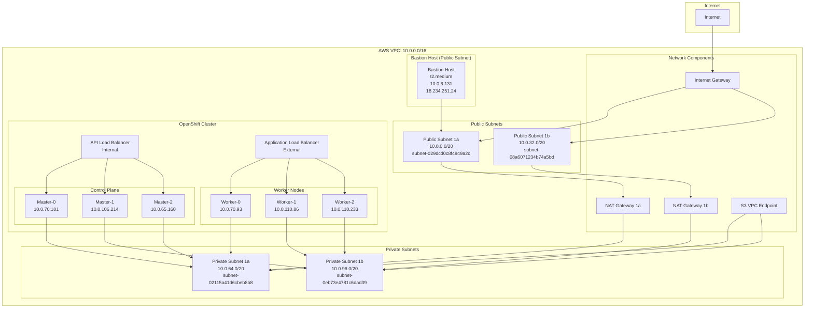
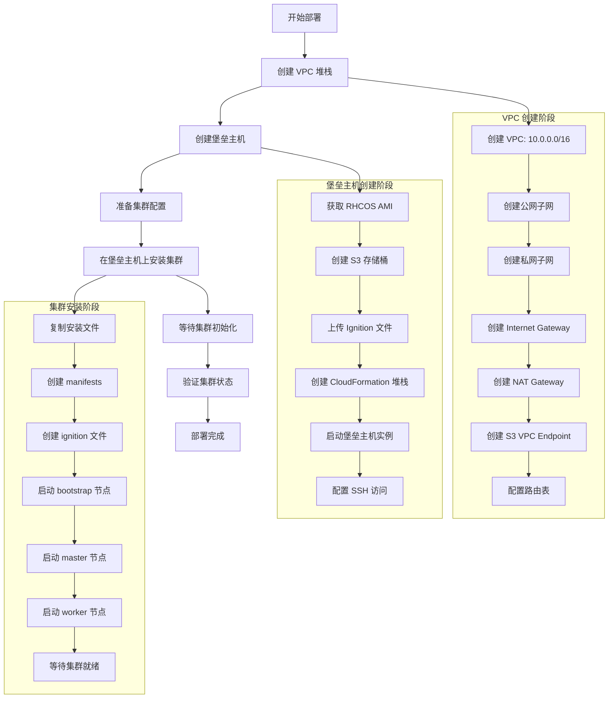

# OpenShift 私有集群部署指南

## 概述

本文档详细描述了在 AWS 上部署 OpenShift 私有集群的完整过程，包括 VPC 网络架构、堡垒主机配置和集群安装步骤。

## 网络架构图

### VPC 网络结构



### 部署流程图



## 网络架构详解

### VPC 配置

- **VPC CIDR**: `10.0.0.0/16`
- **可用区数量**: 2 (us-east-1a, us-east-1b)
- **网络类型**: 私有集群 (Internal)

### 组件部署位置

#### 公网子网组件
- **堡垒主机**: 部署在公网子网 `subnet-029dcd0c8f4949a2c` (us-east-1a)
- **Internet Gateway**: 连接公网子网到互联网
- **NAT Gateway**: 为私网子网提供互联网访问

#### 私网子网组件
- **控制平面节点**: 部署在私网子网中
- **工作节点**: 部署在私网子网中
- **API 负载均衡器**: 内部负载均衡器
- **应用程序负载均衡器**: 外部负载均衡器

### 子网分配

#### 公网子网
- **us-east-1a**: `10.0.0.0/20` (subnet-029dcd0c8f4949a2c)
- **us-east-1b**: `10.0.32.0/20` (subnet-08a6071234b74a5bd)

#### 私网子网
- **us-east-1a**: `10.0.64.0/20` (subnet-02115a41d6cbeb8b8)
- **us-east-1b**: `10.0.96.0/20` (subnet-0eb73e4781c6dad39)

### 网络组件

#### Internet Gateway
- 连接 VPC 到互联网
- 仅用于公网子网中的堡垒主机

#### NAT Gateway
- 每个可用区一个 NAT Gateway
- 为私网子网中的实例提供互联网访问
- 用于下载容器镜像和软件包

#### S3 VPC Endpoint
- 为私网子网提供 S3 访问
- 避免通过 NAT Gateway 访问 S3
- 提高性能和降低成本

## 安全架构

### 安全组配置

#### 堡垒主机安全组
- **入站规则**: SSH (22) 从 0.0.0.0/0
- **出站规则**: 所有流量到 0.0.0.0/0

#### 集群安全组
- **API 服务器**: 6443 端口从堡垒主机安全组
- **控制平面**: 内部通信端口
- **工作节点**: 应用程序端口

### 网络隔离

- **控制平面节点**: 仅在私网子网中，无公网 IP
- **工作节点**: 仅在私网子网中，无公网 IP
- **堡垒主机**: 在公网子网中，有公网 IP，作为访问私网集群的唯一入口
- **API 访问**: 通过内部负载均衡器，仅堡垒主机可访问

## 部署步骤

### 1. 创建 VPC 堆栈

```bash
# 修改 create-vpc-stack.sh 中的配置
STACK_NAME="weli-private-cluster-vpc"
VPC_CIDR="10.0.0.0/16"
AZ_COUNT=2

# 执行 VPC 创建
./create-vpc-stack.sh
```

### 2. 创建堡垒主机

```bash
# 获取 VPC 输出
./get-vpc-outputs.sh weli-private-cluster-vpc

# 创建堡垒主机
./create-bastion-host.sh \
  vpc-0439f81b789b415f4 \
  subnet-029dcd0c8f4949a2c \
  weli4-clu
```

### 3. 配置集群安装

```yaml
# install-config.yaml 关键配置
metadata:
  name: weli4-clu
networking:
  machineNetwork:
    - cidr: 10.0.0.0/16
  networkType: OVNKubernetes
platform:
  aws:
    region: us-east-1
    subnets:
    - subnet-02115a41d6cbeb8b8  # 私网子网 1a
    - subnet-0eb73e4781c6dad39  # 私网子网 1b
publish: Internal  # 私有集群
```

### 4. 在堡垒主机上安装集群

```bash
# 复制文件到堡垒主机
./copy-cluster-files-to-bastion.sh

# 在堡垒主机上执行安装
ssh core@18.234.251.24
./openshift-install create cluster --dir=. --log-level=info
```

## 验证私有集群

### 1. 检查节点网络

```bash
# 所有节点应该没有公网 IP
oc get nodes -o wide
# EXTERNAL-IP 列应该显示 <none>
```

### 2. 检查 AWS 实例

```bash
# 所有实例的 PublicIpAddress 应该是 None
aws ec2 describe-instances \
  --filters "Name=tag:kubernetes.io/cluster/weli4-clu-vklbh,Values=owned" \
  --query 'Reservations[].Instances[].[InstanceId,PublicIpAddress]'
```

### 3. 检查网络配置

```bash
# 确认 publish 设置为 Internal
oc get infrastructure cluster -o yaml
# status.apiServerURL 应该指向内部负载均衡器
```

## 访问方式

### 1. 堡垒主机访问

```bash
ssh core@18.234.251.24
export KUBECONFIG=/var/home/core/auth/kubeconfig
oc get nodes
```

### 2. Web 控制台访问

- **URL**: https://console-openshift-console.apps.weli4-clu.qe1.devcluster.openshift.com
- **访问方式**: 通过应用程序负载均衡器
- **认证**: 使用集群管理员凭据

### 3. API 访问

- **内部 API**: https://api-int.weli4-clu.qe1.devcluster.openshift.com:6443
- **外部 API**: https://api.weli4-clu.qe1.devcluster.openshift.com:6443
- **访问方式**: 通过堡垒主机或 VPN

## 优势

### 1. 安全性
- 控制平面和工作节点完全隔离
- 无公网 IP 暴露
- 通过堡垒主机进行管理访问

### 2. 合规性
- 符合企业安全策略
- 满足数据保护要求
- 支持审计和监控

### 3. 成本效益
- 减少 NAT Gateway 流量
- 使用 S3 VPC Endpoint
- 优化网络性能

## 注意事项

1. **堡垒主机依赖**: 所有管理操作都需要通过堡垒主机
2. **网络配置**: 确保 VPC 和子网配置正确
3. **安全组**: 定期审查和更新安全组规则
4. **监控**: 设置适当的监控和告警
5. **备份**: 定期备份集群配置和数据

## 故障排除

### 常见问题

1. **网络连接问题**
   - 检查 NAT Gateway 状态
   - 验证路由表配置
   - 确认安全组规则

2. **集群访问问题**
   - 验证堡垒主机连接
   - 检查 kubeconfig 配置
   - 确认 API 服务器状态

3. **安装失败**
   - 查看安装日志
   - 检查资源配额
   - 验证 IAM 权限

### 日志位置

- **安装日志**: `~/.openshift_install.log`
- **集群日志**: `oc logs -n openshift-cluster-api-guests`
- **节点日志**: `oc logs -n openshift-machine-api`

---

*本文档基于 OpenShift 4.19.10 和 AWS 环境编写*
