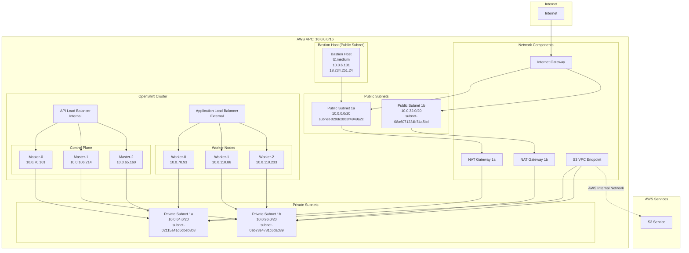
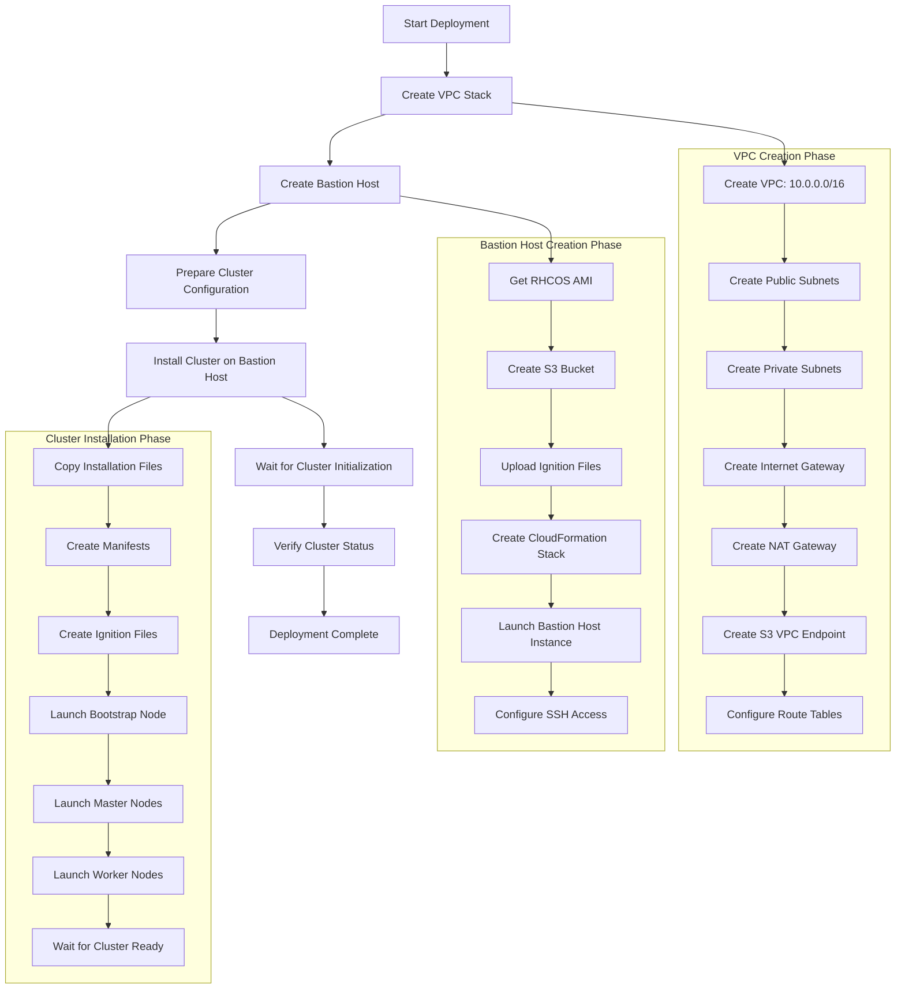

# OpenShift Private Cluster Deployment Guide

## Overview

This document provides a detailed description of the complete process for deploying OpenShift private clusters on AWS, including VPC network architecture, bastion host configuration, and cluster installation steps.

## Network Architecture Diagram

### VPC Network Structure



### Deployment Flow Chart



## Network Architecture Details

### VPC Configuration

- **VPC CIDR**: `10.0.0.0/16`
- **Availability Zones**: 2 (us-east-1a, us-east-1b)
- **Network Type**: Private cluster (Internal)

### Component Deployment Locations

#### Public Subnet Components
- **Bastion Host**: Deployed in public subnet `subnet-029dcd0c8f4949a2c` (us-east-1a)
- **Internet Gateway**: Connects public subnets to internet
- **NAT Gateway**: Provides internet access for private subnets

#### Private Subnet Components
- **Control Plane Nodes**: Deployed in private subnets
- **Worker Nodes**: Deployed in private subnets
- **API Load Balancer**: Internal load balancer
- **Application Load Balancer**: External load balancer

### Subnet Allocation

#### Public Subnets
- **us-east-1a**: `10.0.0.0/20` (subnet-029dcd0c8f4949a2c)
- **us-east-1b**: `10.0.32.0/20` (subnet-08a6071234b74a5bd)

#### Private Subnets
- **us-east-1a**: `10.0.64.0/20` (subnet-02115a41d6cbeb8b8)
- **us-east-1b**: `10.0.96.0/20` (subnet-0eb73e4781c6dad39)

### Network Components

#### Internet Gateway
- Connects VPC to internet
- Only used for bastion host in public subnets

#### NAT Gateway
- One NAT Gateway per availability zone
- Provides internet access for instances in private subnets
- Used for downloading container images and packages

#### S3 VPC Endpoint
- Provides S3 access for private subnets
- Avoids accessing S3 through NAT Gateway
- Improves performance and reduces costs

**Role of S3 VPC Endpoint:**

1. **Direct Access to S3 Service**
   - Allows instances within VPC to directly access S3 buckets
   - No need to go through Internet Gateway or NAT Gateway
   - Uses AWS internal network, not through public internet

2. **Network Architecture Optimization**
   ```
   Traditional way:
   VPC private subnet → NAT Gateway → Internet Gateway → public internet → S3

   Using S3 VPC Endpoint:
   VPC private subnet → S3 VPC Endpoint → S3 (AWS internal network)
   ```

**Specific Uses in Private Clusters:**

1. **OpenShift Installation Process**
   - **Bootstrap node**: Downloads container images and packages
   - **Master nodes**: Pulls Kubernetes component images
   - **Worker nodes**: Pulls application images

2. **Cluster Runtime**
   - **Image registry**: Pulls container images from S3
   - **Log storage**: Uploads cluster logs to S3
   - **Backup data**: Stores cluster backups and configurations

**Advantages:**

1. **Performance Improvement**
   - **Lower latency**: Uses AWS internal network, lower latency than public internet access
   - **Higher bandwidth**: Internal network bandwidth is typically more stable than public connections
   - **Greater throughput**: Suitable for large data transfers

2. **Cost Savings**
   - **Reduced NAT Gateway costs**: Avoids accessing S3 through NAT Gateway
   - **Lower data transfer costs**: AWS internal network transfer costs are lower
   - **Reduced NAT Gateway bandwidth costs**

3. **Enhanced Security**
   - **Network isolation**: Not exposed to public internet
   - **Access control**: Control access permissions through VPC Endpoint policies
   - **Audit logs**: Can record all S3 access logs

4. **Improved Reliability**
   - **Avoids public internet dependency**: Not dependent on Internet Gateway availability
   - **Reduces network failure points**: Reduces failure points in network path
   - **Improves availability**: AWS internal network is typically more stable than public internet

**Configuration in VPC Template:**

```yaml
S3Endpoint:
  Type: AWS::EC2::VPCEndpoint
  Properties:
    ServiceName: !Join
      - ''
      - - com.amazonaws.
        - !Ref 'AWS::Region'
        - .s3
    PolicyDocument:
      Version: 2012-10-17
      Statement:
      - Effect: Allow
        Principal: '*'
        Action:
        - '*'
        Resource:
        - '*'
    RouteTableIds:
    - !Ref PublicRouteTable
    - !Ref PrivateRouteTable
    - !If [DoAz2, !Ref PrivateRouteTable2, !Ref "AWS::NoValue"]
    - !If [DoAz3, !Ref PrivateRouteTable3, !Ref "AWS::NoValue"]
    VpcId: !Ref VPC
```

**Actual Effects:**

1. **Installation Phase**:
   - Bootstrap node downloads ignition files through S3 VPC Endpoint
   - Master nodes pull container images through S3 VPC Endpoint

2. **Runtime Phase**:
   - Cluster components access image registry through S3 VPC Endpoint
   - Applications pull images through S3 VPC Endpoint

3. **Network Path**:
   ```
   Private subnet → S3 VPC Endpoint → S3 service
   ```
   Instead of:
   ```
   Private subnet → NAT Gateway → Internet Gateway → public internet → S3
   ```

## Security Architecture

### Security Group Configuration

#### Bastion Host Security Group
- **Inbound Rules**: SSH (22) from 0.0.0.0/0
- **Outbound Rules**: All traffic to 0.0.0.0/0

#### Cluster Security Group
- **API Server**: Port 6443 from bastion host security group
- **Control Plane**: Internal communication ports
- **Worker Nodes**: Application ports

### Network Isolation

- **Control Plane Nodes**: Only in private subnets, no public IP
- **Worker Nodes**: Only in private subnets, no public IP
- **Bastion Host**: In public subnet with public IP, serves as the only entry point to access private cluster
- **API Access**: Through internal load balancer, only accessible from bastion host

## Deployment Steps

### 1. Create VPC Stack

```bash
# Modify configuration in create-vpc-stack.sh
STACK_NAME="weli-private-cluster-vpc"
VPC_CIDR="10.0.0.0/16"
AZ_COUNT=2

# Execute VPC creation
./create-vpc-stack.sh
```

### 2. Create Bastion Host

```bash
# Get VPC outputs
./get-vpc-outputs.sh weli-private-cluster-vpc

# Create bastion host
./create-bastion-host.sh \
  vpc-0439f81b789b415f4 \
  subnet-029dcd0c8f4949a2c \
  weli4-clu
```

### 3. Configure Cluster Installation

```yaml
# Key configuration in install-config.yaml
metadata:
   name: weli4-clu
networking:
   machineNetwork:
      - cidr: 10.0.0.0/16
   networkType: OVNKubernetes
platform:
   aws:
      region: us-east-1
      subnets:
         - subnet-02115a41d6cbeb8b8  # Private subnet 1a
         - subnet-0eb73e4781c6dad39  # Private subnet 1b
publish: Internal  # Private cluster
```

### 4. Install Cluster on Bastion Host

```bash
# Copy files to bastion host
./copy-cluster-files-to-bastion.sh

# Execute installation on bastion host
ssh core@18.234.251.24
./openshift-install create cluster --dir=. --log-level=info
```

## Verify Private Cluster

### 1. Check Node Network

```bash
# All nodes should have no public IP
oc get nodes -o wide
# EXTERNAL-IP column should show <none>
```

### 2. Check AWS Instances

```bash
# PublicIpAddress of all instances should be None
aws ec2 describe-instances \
  --filters "Name=tag:kubernetes.io/cluster/weli4-clu-vklbh,Values=owned" \
  --query 'Reservations[].Instances[].[InstanceId,PublicIpAddress]'
```

### 3. Check Network Configuration

```bash
# Confirm publish is set to Internal
oc get infrastructure cluster -o yaml
# status.apiServerURL should point to internal load balancer
```

## Access Methods

### 1. Bastion Host Access

```bash
ssh core@18.234.251.24
export KUBECONFIG=/var/home/core/auth/kubeconfig
oc get nodes
```

### 2. Web Console Access

- **URL**: https://console-openshift-console.apps.weli4-clu.qe1.devcluster.openshift.com
- **Access Method**: Through application load balancer
- **Authentication**: Using cluster administrator credentials

### 3. API Access

- **Internal API**: https://api-int.weli4-clu.qe1.devcluster.openshift.com:6443
- **External API**: https://api.weli4-clu.qe1.devcluster.openshift.com:6443
- **Access Method**: Through bastion host or VPN

## Advantages

### 1. Security
- Complete isolation of control plane and worker nodes
- No public IP exposure
- Management access through bastion host

### 2. Compliance
- Complies with enterprise security policies
- Meets data protection requirements
- Supports auditing and monitoring

### 3. Cost Effectiveness
- Reduces NAT Gateway traffic
- Uses S3 VPC Endpoint
- Optimizes network performance

## Notes

1. **Bastion Host Dependency**: All management operations require going through the bastion host
2. **Network Configuration**: Ensure VPC and subnet configurations are correct
3. **Security Groups**: Regularly review and update security group rules
4. **Monitoring**: Set up appropriate monitoring and alerting
5. **Backup**: Regularly backup cluster configurations and data

## Troubleshooting

### Common Issues

1. **Network Connection Issues**
   - Check NAT Gateway status
   - Verify route table configuration
   - Confirm security group rules

2. **Cluster Access Issues**
   - Verify bastion host connection
   - Check kubeconfig configuration
   - Confirm API server status

3. **Installation Failures**
   - View installation logs
   - Check resource quotas
   - Verify IAM permissions

### Log Locations

- **Installation Logs**: `~/.openshift_install.log`
- **Cluster Logs**: `oc logs -n openshift-cluster-api-guests`
- **Node Logs**: `oc logs -n openshift-machine-api`

---

*This document is written based on OpenShift 4.19.10 and AWS environment*